<!-- ko-mirror: 독립 검토자 승인 (P4), 2026-09-16.
     저자 재량으로 유지한 항목: 기동(起動, 현장 통용) / 계열 / assets/*.svg 영문 / 종단 작업.
     기준: knowledge-base knowledge/methodology/korean-translation.md -->


*[English](README.md) · 한국어*

# CUBRID ImportDB

**CUBRID `unloaddb` 덤프를 명령 하나로 되돌리는 도구입니다.** 덤프 디렉터리를 읽어
스키마의 의존 그래프에서 적재 순서를 직접 계산하고, 제약 조건이 없는 힙에 데이터를
넣은 다음, 인덱스와 외래 키를 나중에 한꺼번에 만듭니다. 그래서 기존의 스키마-우선
스크립트보다 빠르고 — 그 스크립트가 한 번도 하지 않는 일, 즉 엔진에게 외래 키를 실제로
검사시키는 일을 합니다.

```
cubrid-importdb -u dba newdb /path/to/dump
```

전체 데이터베이스를 재적재할 때 운영자가 다룰 것은 이게 전부입니다. `unloaddb`가 써 놓은
디렉터리를 가리키면 나머지는 도구가 알아서 합니다.

**현재 상태.** 이것은 **비공식** 도구입니다. CUBRID 배포판의 일부가 아니고, CUBRID
프로젝트의 승인을 받지도 않았으며, **운영 환경에서 검증된 적이 없습니다.** 동작한다는
근거는 [`tests/`](tests/README.md), [`demo/`](demo/README.md),
[`contract/`](contract/README.md)의 테스트 스위트가 전부이고 그 바깥은 없습니다. 잃으면
곤란한 데이터에 적용하기 전에 사본으로 먼저 평가해 보십시오.

`cubrid` 하위 명령이 아니라 별도 바이너리인 이유는 엔진 *바깥에서* 빌드되기 때문입니다.
엔진 안이 아니라 엔진을 상대로 빌드하므로, CUBRID 본체를 건드리지 않고 개발하고 배포할
수 있습니다. [docs/out-of-tree.md](docs/out-of-tree.md)를 보십시오.

**시작하기 전에.** 이 도구를 여러분 환경에서 쓸 수 있는지는 다음 네 가지가 가릅니다.

| | |
|---|---|
| **대상 엔진** | **CUBRID 11.5 이상**입니다. 현재 11.5는 nightly 계열이므로, 릴리스된 11.4 이하를 대상으로는 아예 동작하지 않습니다. 반면 *읽는* 덤프는 10.2부터 받습니다. 두 버전은 서로 무관합니다. [요구 사항](#요구-사항) 참고. |
| **바이너리** | 함께 쓸 엔진을 상대로 소스에서 빌드합니다. 바이너리 릴리스도 `cmake --install` 타깃도 없으므로, `cubrid-importdb`가 `PATH`에 잡히는 것은 직접 올려놓았을 때뿐입니다 — [설치](#설치) 참고. 그 전까지는 `build/cubrid-importdb`입니다. |
| **대상 데이터베이스** | 직접 만들어서 **기동해 두어야** 하고, **사용자 클래스가 없어야** 합니다. importdb는 이미 있는 데이터베이스 *안으로* 임포트할 뿐, 데이터베이스를 만들지 않습니다. [첫 임포트](#첫-임포트) 참고. |
| **덤프 디렉터리** | **쓰기 가능**해야 합니다. 재개용 매니페스트와, 위반이 있을 경우 예외 파일이 덤프 옆에 기록됩니다. 읽기 전용으로 마운트한 NFS 덤프는 그대로는 쓸 수 없습니다. |

**급하신가요?** [요구 사항](#요구-사항) → [설치](#설치) → [첫 임포트](#첫-임포트).
이 세 절보다 앞에 있는 내용은 전부 이 도구가 왜 필요한지에 대한 논증이니 건너뛰어도
됩니다.

<details>
<summary>목차</summary>

**왜** — [무엇이 문제인가](#무엇이-문제인가) · [기능](#기능) ·
[동작 방식](#동작-방식) · [참조 무결성](#참조-무결성) ·
[구버전 엔진이 만든 덤프 읽기](#구버전-엔진이-만든-덤프-읽기) · [성능](#성능)

**쓰는 법** — [요구 사항](#요구-사항) · [설치](#설치) · [첫 임포트](#첫-임포트) ·
[사용법](#사용법) · [하지 않는 것](#하지-않는-것)

**개발하기** — [개발](#개발) · [라이선스](#라이선스)

</details>

---

## 무엇이 문제인가

`unloaddb`는 디렉터리 하나를 건네줍니다. 그걸 되돌리는 일은 여러분 몫입니다.

```sh
cubrid loaddb -C -u dba -s mydb_schema  newdb   # 스키마가 먼저이므로 모든
cubrid loaddb -C -u dba -d mydb_objects newdb   # PK/UNIQUE/FK가 살아 있는 채로
cubrid loaddb -C -u dba -i mydb_indexes newdb   # 행 단위로 유지된다
```

작은 데이터베이스 하나를 되돌리는 데도 명령을 세 번 쳐야 하고, 그 순서를 틀리지 않는 것까지
여러분 책임입니다.
여기서 두 가지를 잃습니다.

**속도.** `unloaddb`는 기본 키와 유니크 제약, **그리고 외래 키까지** `<prefix>_schema`에
씁니다. 그래서 스키마를 먼저 넣으면 데이터 단계 내내 모든 제약 조건이 살아 있고 행 하나마다
유지됩니다. `_indexes`로 미뤄지는 것은 평범한 보조 인덱스뿐입니다.

**정확성, 그리고 이쪽이 진짜 문제입니다.** `loaddb`는 데이터 단계 동안 외래 키 검사를
*끄고*, 끝난 뒤에도 다시 켜서 재검사하지 않습니다. 부모 없는 행이 든 덤프를 넣어도 성공하고,
아무것도 보고하지 않으며, FOREIGN KEY가 카탈로그에는 **있는데 데이터는 그것을 위반하는**
데이터베이스를 남깁니다. 엔진 스스로는 만들기를 거부할 상태입니다. 여러분은 한참 뒤에
엉뚱한 질의 결과를 보고서야 알게 됩니다.

CUBRID ImportDB는 이 자리를 명령 하나로 대체합니다. 의존 그래프에서 적재를 계획하고, 힙에만
넣은 뒤 제약 조건을 일괄로 만들며, 데이터가 만족시키지 못하는 외래 키는 정의하기를
거부합니다 — 어느 행이 문제인지를 정확히 알려주면서.


*그림 1 — 같은 12개 행, 두 가지 방식. 제약 조건을 살려 두면 행마다, 인덱스마다 b-tree
쓰기 비용이 한 번씩 들고도 외래 키는 검사되지 않은 채로 남아, 고아 행이 그대로 통과합니다.
제약을 떼어내고 나중에 만들면 그 만드는 과정 자체가 검사가 되어, 같은 고아 행이 바로
여기서 걸립니다.*

## 기능

**덤프 전체를 명령 하나로.** 스키마·오브젝트·인덱스 파일과 그 파일들이 어떤 배치로
쓰였는지(기본 단일 파일인지 `--datafile-per-class`인지)를 스스로 찾아냅니다. 여러분이
맞춰야 할 순서는 없습니다.

**의존성을 아는 계획 수립.** 스키마를 정의한 뒤 카탈로그를 읽어 외래 키·상속·파티셔닝·시리얼로
그래프를 만들고 레벨 순서대로 적재합니다. 외래 키 정의는 간선마다 뒤로 미루므로,
서로를 참조하는 테이블도 따로 손댈 필요가 없습니다 — 순환도 다른 것과 똑같이 한 번에
적재됩니다.

**힙에만 넣는 적재.** PK/UNIQUE/FK를 떼어내고 힙에만 데이터를 넣은 다음, 행이 다 찬 테이블 위에서
제약 조건을 일괄로 만듭니다. 데이터 단계에는 행 단위 인덱스 유지가 없습니다.

**참조 무결성을 가정하지 않고 강제합니다.** 모든 외래 키는 적재된 데이터를 상대로
정의됩니다. 데이터가 위반하면 importdb는 문제가 되는 행을 *전부* 열거하고(엔진은 첫 번째
것만 알려줍니다) 깨진 외래 키를 정의하는 대신 보류합니다.

**판정 역시 가정하지 않고 확인합니다.** 실행이 스스로를 완료라고 부르기 전에 카탈로그를 다시
읽어, 스냅숏이 이름을 댄 모든 제약 조건이 실제로 거기 있거나 보류로 기록되어 있어야 합니다.
단계별 카운터는 importdb 자신의 장부이고, 그 장부가 실제 실행과 어긋났다는 것을 잡아낼 수
있는 단계는 이것뿐입니다. 어긋나면 판정은 PARTIAL이 되고 무엇이 빠졌는지 이름이 나옵니다.

**손댈 수 있는 형태의 수리 기록.** `importdb.exceptions`는 고아 행을 기본 키로(기본 키가
없는 자식 테이블이면 위치로) 하나씩 적고, 데이터를 고친 뒤 보류된 외래 키를 추가할 DDL을
그대로 담고 있습니다.

**실시간 표시.** 터미널에서는 현재 단계, 파이프라인 안에서의 위치, 각 로더가 오브젝트 파일을
어디까지 읽었는지를 보여주는 진행 블록이 뜹니다. 표준 출력이 터미널이 아니면 자동으로
꺼집니다.

**테이블 간 병렬.** `--degree=N`은 오브젝트 파일당 하나씩 로더 N개를 동시에 돌립니다.
나눠 가질 것이 있으려면 `--datafile-per-class` 덤프여야 합니다.

**구버전 엔진이 만든 덤프를 읽습니다.** 10.2 이상입니다. 11.5 이전의 `unloaddb`는
`CALL ... ON CLASS`의 대상으로 카탈로그 *뷰*의 이름을 적는데, 11.5에서 그 뷰들이 메서드를
지닌 클래스와 분리되었습니다. importdb는 영향을 받는 세 대상을 `loaddb`가 하는 방식대로
바꿔 쓰고 그 사실을 알립니다. 이것이 없으면 시리얼을 가진 데이터베이스의 10.2 덤프는 전부
거부됩니다.

**재개.** 죽은 임포트를 같은 명령으로 다시 실행하면 처음부터가 아니라 매니페스트에서부터
이어집니다.

**HA 문제를 숨기지 않습니다.** `ha_mode=on`인 대상은 기본적으로 거부합니다. 힙에만 넣는 적재는
스탠바이로 복제되지 않기 때문입니다. `--allow-ha`로 넘길 수 있고, 그 경우 적재 전에 한 번,
판정에서 한 번, 두 번 경고합니다.

**`--dry-run`.** 계획과 종단 작업 순서를 출력하고 아무것도 바꾸지 않습니다.

## 동작 방식

**Discover → Define → Graph → Plan → Strip → Load → Rebuild → FK define → Stats →
Triggers.** 중요한 모양은 가운데에 있습니다. 스키마를 정의하고, 그 제약 조건 집합을
스냅숏으로 떠 둔 다음 *떼어내고*, 데이터는 제약 없는 힙으로 들어가고, 제약 조건은 나중에 일괄로
만들어집니다. 트리거는 반드시 맨 마지막에 정의되므로 적재 도중에는 아무것도 발화하지
않습니다.



*그림 2 — 진행 블록이 매기는 번호 그대로의 파이프라인. 막대는 393만 행 실행에서 각 단계가
실제로 차지한 비중입니다. 제약 조건을 만드는 두 단계가 80%이고, 둘 다 직렬입니다.*

앞의 네 단계는 손으로 짠 스크립트 쪽에 대응물이 없는 부분입니다. `loaddb`는 명령 세 개를
타이핑한 사람에게서 순서를 받습니다. importdb는 스키마를 정의한 뒤 대상 카탈로그를 읽어
순서를 스스로 도출합니다 — 순환이 특별한 경우가 아닌 이유이기도 합니다. 외래 키 정의를 간선마다
미루므로, 서로를 참조하는 두 테이블은 같은 레벨에 놓이고 한 번에 적재됩니다.



*그림 3 — shop 픽스처에서의 Discover, Define, Graph, Plan. 그래프와 세 개의 레벨 집합,
열일곱 개의 종단 작업은 실제 실행이 낸 것으로 [docs/output.md](docs/output.md)에
출력되어 있습니다. 주석의 순환은 `tests/fixtures/fkcycle.sql`이며, `cy_a`와 `cy_b`가
서로를 참조해 어떤 적재 순서로도 두 외래 키를 동시에 만족시킬 수 없습니다.*

외래 키는 적재된 데이터를 상대로 정의되고, 엔진이 그것을 검증하는 자리가 바로 거기입니다 —
`ADD CONSTRAINT ... FOREIGN KEY`는 기존 행들 위로 외래 키의 b-tree를 만들면서 각 키를
부모와 대조합니다. importdb는 그 일을 중복해서 하지 않고, 엔진이 멈추는 지점부터만
넘겨받습니다.

각 단계는 자기가 무엇을 했는지 알립니다. 아래는 깨끗한 실행이며, 함께 출력되는 그래프와
스케줄은 뺐습니다.

```
importdb: rostered default dump (prefix 'shop') from /tmp/rmcap/dump
importdb: defined 'shoptgt'.
importdb: stripped 11 constraint(s) from 'shoptgt'.
importdb: loaded 3008 row(s) from 1 object file(s) into 'shoptgt'.
importdb: rebuilt 8 constraint(s) and built 2 index(es) on 'shoptgt'.
importdb: every FOREIGN KEY on 'shoptgt' was accepted by the engine -- 3 edge(s) clean, 0 skipped (parent key withheld).
importdb: defined 3 FK(s) on 'shoptgt'.
importdb: updated statistics on 5 class(es) in 'shoptgt'.
```

실행은 통합 리포트로 끝납니다. 클래스별 판정, 행 수, 그리고 여러분이 수리해야 할 것이
남았다면 그 내역입니다. 터미널에서는 이 줄들이 제자리에서 다시 그려지는 블록 아래로
흘러가는데, 그 블록은 지금 어느 단계이고, 몇 개가 남았고, 그 안에서 얼마나 진행되었는지를
답해 줍니다. 출력된 줄들이 답하지 못하는 것들입니다.

```
 importdb  tuitgt                                           load  [6/10]  00:00
  ███████████░░░░░░░░░░░░░░░░░░░░░░░░░░░░░░░░░░░░░░  23%  0/4 done · 2 loading
    tuisrc_dba.customer         ██████████████████████████████░░░░░  85%  2 MB
    tuisrc_dba.orders           ██████░░░░░░░░░░░░░░░░░░░░░░░░░░░░  17%  18 MB
```

파일별 막대는 추정이 아니라 실측입니다. 로더는 별도의 `cub_admin loaddb -C` 프로세스인데
— `cub_admin`은 `cubrid loaddb` 뒤에 있는 실제 바이너리이고, importdb는 `cubrid` 프론트엔드를
거치지 않고 이것을 직접 exec 합니다 — 종료할 때까지 아무것도 보고하지 않으므로 importdb가
`/proc/<pid>/fdinfo`에서 각 프로세스의 파일 오프셋을 읽습니다. 표준 출력이 터미널이 아니면
표시는 꺼지므로 파이프나 파일, CI 로그에는 늘 받던 그 평범한 출력만 갑니다.

파이프라인의 꼬리는 두 경로가 갈리는 또 하나의 자리입니다. `loaddb`는 클래스별 통계를
*오브젝트* 적재가 끝나는 시점에 갱신합니다. 그 뒤에 적재되는 인덱스 파일은 `_db_index`와
`_db_indexkey`의 **카탈로그** 통계만 새로 고치므로, 앞서 계산된 클래스 통계는 그 뒤에
만들어지는 보조 인덱스보다 시점이 앞섭니다. 질의 계획이 그 대가를 얼마나 치르는지는 여기서
측정하지 않았습니다. importdb는 그 질문에 답하는 대신 질문 자체를 없앱니다. 모든 로더
자식에 `--no-statistics`를 주고, `STATS`는 해당 클래스의 재구축 *그리고* 인덱스 생성이
끝난 뒤에 클래스별로 스케줄합니다 — `#12 STATS audit_log [after #0, #8]`에서 `#8`이 인덱스
생성입니다.



*그림 4 — 두 경로에서 클래스별 통계가 언제 계산되는지, 그리고 실행이 내보이는 두 가지 화면:
제자리에서 다시 그려지는 블록과 그 아래로 흘러가는 단계 줄들.*

덤프가 정의하는 모든 것은 덤프 자신의 DDL에서 재생됩니다. 그 범위는 보기보다 넓습니다.
**사용자, 비밀번호 해시, 권한까지 전부 돌아옵니다.**

그래프와 스케줄이 포함된 전체 실행, 리포트, 예외 파일, 비밀번호가 어떻게 넘어오는지는
[docs/output.md](docs/output.md)를 보십시오.

## 참조 무결성

보여줄 가치가 있는 차이는 이것입니다. `customer_id`가 존재하지 않는 고아 `orders` 행 두
개가 든 덤프를 가정합니다.

**손으로 짠 `loaddb` 경로**는 이것을 받아들이고 exit 0으로 끝나며 아무것도 보고하지 않습니다.
FOREIGN KEY는 그것을 위반하는 데이터와 함께 카탈로그에 남습니다. 같은 데이터 위에 같은 외래
키를 만들어 달라고 엔진에 요청하면 엔진은 거부합니다. `loaddb`는 엔진이라면 허용하지 않았을
상태를 남긴 것입니다.

**CUBRID ImportDB**는 같은 덤프를 받아 데이터를 적재하고, 깨끗한 외래 키는 정의하고, 위반된
것은 보류하고, exit 1로 끝냅니다.

```
importdb: stripped 11 constraint(s) from 'shopbad'.
importdb: loaded 3010 row(s) from 5 object file(s) into 'shopbad'.
importdb: rebuilt 8 constraint(s) and built 2 index(es) on 'shopbad'.
importdb: the engine rejected the FOREIGN KEY and found 2 orphan row(s) on 'orders' -> 'customer' [fk_orders_customer]; that FK is withheld and its offenders enumerated.
importdb: 'shopbad' has referential violations -- 1 FOREIGN KEY(s) rejected by the engine, 2 orphan row(s) total; offenders written to /tmp/rmcap/perclass/importdb.exceptions. See the manifest [validate] section; importdb exits non-zero.
importdb: defined 1 FK(s), withheld 2 on 'shopbad' (the engine rejected the data, or the parent key was un-rebuilt); re-add DDL recorded in the manifest [fkdefine] section and /tmp/rmcap/perclass/importdb.exceptions. importdb exits non-zero.
importdb: updated statistics on 5 class(es) in 'shopbad'.
```

그리고 모든 위반 행을 `importdb.exceptions`에 열거하고, 데이터를 고친 뒤 보류된 외래 키를
추가할 DDL을 함께 적습니다 —
[docs/output.md](docs/output.md#the-exceptions-artifact)를 보십시오. 엔진은 처음 걸린
값 하나만 알려주고 멈춥니다. `--continue`는 첫 번째에서 멈추는 대신 모든 간선을 시도합니다.

`demo/run_demo.sh`가 두 경로를 나란히 돌려 보여줍니다 — [`demo/`](demo/README.md) 참고.

## 구버전 엔진이 만든 덤프 읽기

재적재는 보통 *마이그레이션*입니다. 덤프는 떠나는 버전이 쓰고, 도착하는 버전이 읽습니다.
importdb는 **CUBRID 10.2 이상**의 덤프를 읽으며, 그럴 수 있는 이유는 대체로 구조적입니다.
그래프, 계획, 제약 제거, 재구축, 외래 키 정의가 전부 덤프의 DDL을 파싱해서가 아니라 대상의
카탈로그를 읽어서 이뤄지기 때문입니다.

구조적이지 않은 부분은 덤프 자신의 텍스트입니다. 그것은 엔진 자신의 파서로 넘어가므로
importdb는 옛 구문을 받아 주는 `loaddb -s`의 관용 범위를 그대로 물려받습니다 — 고칠 수밖에 없었던
하나만 빼고. 11.5 이전의 `unloaddb`는 `CALL ... ON CLASS`의 대상으로 카탈로그 *뷰*의 이름을
적는데 11.5가 그 메서드들을 옮겼습니다. 시리얼을 가진 데이터베이스의 10.2 덤프에는 이것이
반드시 하나 들어 있으므로, importdb가 바꿔 쓰기 시작하기 전까지는 그 부류의 덤프 전체가
거부되었습니다.

`tests/run_tests.sh crossversion`이 그 증거이며, 실제 10.2 설치본 위에서 돌아갑니다. 이 케이스는
데이터를 10.2 원본과 대조하고, 카탈로그와 권한 집합은 같은 픽스처의 *현행* 덤프로 만든
대상과 대조합니다. 셋 다 바이트 단위로 동일합니다.

하한선의 근거, 검사로 막아 둔 형태들, 그리고 막을 수 없는 두 가지는
[docs/old-dumps.md](docs/old-dumps.md)를 보십시오.

## 성능

**병렬도를 맞춘** `loaddb` 기준선과 비교해 측정했습니다. 기준선도 같은 오브젝트 파일들을
같은 상한으로 나눠 가지므로, 비교가 importdb에 동시성 몫을 얹어 주는 대신 제약 조건의
수명 차이만 떼어냅니다. `tests/run_tests.sh perf` **자체가** 그 측정이며, 별도의 벤치마크는
없습니다.

| 병렬도 | loaddb | importdb | 비율 중앙값 | 속도 향상 |
|---|---|---|---|---|
| **1** | 5.70 s | 2.68 s | 0.481 &nbsp;(쌍별 0.444 – 0.677) | **2.13× 빠름** |
| **4** | 5.08 s | 1.67 s | 0.362 &nbsp;(쌍별 0.327 – 0.410) | **3.04× 빠름** |

오브젝트 파일 다섯 개에 걸친 393,000행, 측정 쌍 다섯 번의 중앙값, 16코어 리눅스 호스트 한
대에서. 스톱워치 값이 아니라 비율을 쓴 것은 의도적입니다. 같은 기준선 작업이 한 번의 실행
안에서 3.59초로도, 6.07초로도 측정된 적이 있습니다. 여러분의 하드웨어에서 직접 재 보십시오.

믿고 쓰기 전에 알아 둘 것이 셋 있습니다.

- **작은 덤프에는 이득이 없습니다.** 고정 비용(카탈로그 스냅숏, 제약 제거, 재구축, 파일당
  자식 프로세스)은 행 수와 무관하게 그대로 듭니다.
- **`--degree`에는 `--datafile-per-class` 덤프가 필요합니다.** 펼쳐지는 단위가 오브젝트
  파일이므로, 기본 단일 파일 덤프는 무엇을 넘기든 직렬로 돕니다. 이 경우 실행 시간을 보고
  짐작하게 두는 대신 실행이 그렇다고 말해 줍니다.
- **이보다 열 배 큰 규모에서는 양상이 달라집니다.** 외래 키 정의가 실행의 절반을 차지하고
  `--degree`는 더 이상 도움이 되지 않는데, 원인은 importdb 쪽 문제가 아니라
  `data_buffer_size`입니다. importdb는 덤프에 비해 페이지 버퍼가 작으면 경고합니다. 수치는
  아래 문서에 있습니다.

방법론, 393만 행에서의 단계별 분해, 페이지 버퍼의 변곡점, 그리고 측정해 보니 틀렸던 세 가지
설명은 [docs/performance.md](docs/performance.md)를 보십시오.

## 요구 사항

- **CUBRID 11.5 이상** — importdb가 *붙어서 동작하는* 엔진 이야기입니다. 이것부터 읽으십시오.
  **11.5는 아직 릴리스된 계열이 아닙니다.** 그래서 지금 운영에서 돌리고 있는 엔진은 거의
  확실히 importdb의 대상이 될 수 없습니다. `tools/fetch_engine.sh`가 11.5 *nightly*를 기본으로
  삼는 이유가 정확히 이것이고, 11.4는 `--release 11.4_latest`로만 닿는데 그것은 덤프를 만드는
  쪽이지 대상이 아닙니다. importdb가 *읽는* 덤프는 별개의 문제이고 하한선도 훨씬 낮습니다 —
  10.2 이상이며 [구버전 엔진이 만든 덤프 읽기](#구버전-엔진이-만든-덤프-읽기)를 보십시오.
  importdb는 AUTO_INCREMENT 시리얼을 찾기 위해 `_db_serial` 시스템 클래스를 읽는데(`db_serial`
  뷰에는 빠져 있습니다) 11.4 이하에서는 그 읽기가 거부됩니다. 버전 검사로 막지는 않습니다.
  구버전 엔진에서는 [`contract/`](contract/README.md)의 `_db_serial` 프로브가 실패하고, 실제
  임포트는 그래프 단계에서 실패합니다.
- importdb 자체를 빌드하려면 리눅스, C++17 컴파일러, CMake 3.16 이상.
- CUBRID 엔진을 *구성(configure)* 하려면 — 아래 빌드가 생성 헤더를 얻기 위해 하는 일입니다 —
  Ninja 또는 Make, JDK, bison, flex, ncurses, 그리고 `dtrace`가 추가로 필요합니다. CI가
  설치하는 집합은 `cmake ninja-build gcc g++ libncurses-dev bison flex openjdk-17-jdk
  systemtap-sdt-dev`입니다. 뒤의 둘은 선택이 아니고, 둘 다 자명하지도 않습니다. 엔진은
  `ENABLE_SYSTEMTAP`을 기본으로 켜 두어 `dtrace` 없이는 CMake가 멈추고,
  `find_package(JNI REQUIRED)`는 AWT를 원하는데 *headless* JDK에는 그것이 없습니다.
- 컴파일 대상이 될 CUBRID **소스 트리**와 구성된 **빌드 트리**, 그리고 링크하고 실행할
  **설치본**. [설치](#설치)를 보십시오.

  대부분의 CUBRID 사용자가 가장 멀리 있는 조건이 이것입니다. tarball이나 RPM 설치본만으로는
  부족합니다. importdb의 번역 단위가 엔진의 *생성된* 헤더를 include 하는데, 그것은 구성된
  빌드 트리만이 만들어 내기 때문입니다. 엔진을 빌드할 필요는 없습니다 — 구성하고 헤더 생성기
  다섯 개를 빌드하는 데 20초쯤 걸립니다 — 다만 소스는 있어야 합니다. 설치본만 있다면 비슷한
  소스가 아니라 **일치하는** 소스를 받으십시오. `tools/fetch_engine.sh`는 *같은* 빌드의 소스와
  설치본 tarball을 `ftp.cubrid.org`에서 함께 받아 오고, 받아 온 버전과 커밋을
  `<dest>/engine.env`에 기록하므로 짝이 어긋날 수 없습니다.

## 설치

이것은 소스 배포판입니다. 함께 돌아갈 CUBRID를 상대로 직접 빌드합니다. 바이너리 릴리스는
없고, 그것은 의도된 것입니다 — [docs/out-of-tree.md](docs/out-of-tree.md)를 보십시오.

가장 빠른 길은 nightly 배포입니다. 같은 빌드에서 나온 소스와 설치본이 한 쌍으로 함께 올라옵니다.

```sh
git clone https://github.com/cubrid-systems/cubrid-importdb
cd cubrid-importdb

# ftp.cubrid.org에서 CUBRID 소스 트리 + 설치본을 받는다 (같은 빌드이므로 어긋남 없음)
tools/fetch_engine.sh --nightly 11.5 engine

# 이 유틸리티의 번역 단위는 엔진의 생성 헤더와 3rdparty 헤더를 필요로 하는데,
# 그것은 빌드된 엔진이 아니라 '구성된' 빌드 트리에서 나온다
cmake -S engine/src -B engine/build -G Ninja -DCMAKE_BUILD_TYPE=RelWithDebInfo
cmake --build engine/build --target rapidjson re2 lz4 libexpat libjansson

export CUBRID="$PWD/engine/install"
cmake -S . -B build -DCUBRID_SOURCE_DIR="$PWD/engine/src" -DCUBRID_BUILD_DIR="$PWD/engine/build"
cmake --build build -j"$(nproc)"

build/cubrid-importdb --help     # 사용법을 출력한다
build/cubrid-importdb --version  # 어떤 CUBRID를 상대로 빌드되었는지
```

엔진을 구성하고 헤더 생성기만 빌드하는 데 20초 정도 걸립니다. 엔진 자체는 빌드하지 않습니다.

**빌드는 `build/cubrid-importdb`에서 끝납니다.** `cmake --install` 타깃이 없고 바이너리를
`PATH`에 올려 주는 것도 없으므로, 이 문서 전체에서 쓰는 짧은 `cubrid-importdb ...` 형태는
여러분이 직접 설치한 뒤에야 성립합니다. 엔진 자신의 유틸리티 옆이 가장 깔끔한 자리입니다.
importdb를 돌리는 모든 환경이 이미 그 디렉터리를 `PATH`에 두고 있기 때문입니다.

```sh
cp build/cubrid-importdb "$CUBRID/bin/"    # 이제 `cubrid-importdb`가 잡힌다
cubrid-importdb --version
```

이 단계를 건너뛰어도 아래의 모든 예시는 `build/cubrid-importdb`를 그대로 쓰거나, 클론이 아닌
디렉터리에서라면 `$IMPORTDB/build/cubrid-importdb`를 쓰면 똑같이 동작합니다. 다만 나중에
같은 `engine/`에 `tools/fetch_engine.sh`를 다시 돌리면 설치 트리가 교체되면서 복사해 둔
바이너리도 함께 없어집니다.

이미 갖고 있는 CUBRID를 상대로 하려면 `CUBRID_SOURCE_DIR`과 `CUBRID_BUILD_DIR`를 여러분의
트리로, `$CUBRID`를 설치본으로 가리키면 됩니다. 설치본은 있는데 소스가 없다면 — tarball이나
RPM 배포에서는 이쪽이 정상입니다 — 비슷한 것에 맞춰 빌드하지 말고 그 빌드의 소스를 받으십시오.

```sh
cubrid_rel     # CUBRID 11.5.0 (11.5.0.2513-5f3a30d) (64bit release build ...

# 괄호 안의 빌드 문자열이 --nightly-version 인자 그대로다
tools/fetch_engine.sh --nightly-version 11.5.0.2513-5f3a30d engine
cmake -S engine/src -B engine/build -G Ninja -DCMAKE_BUILD_TYPE=RelWithDebInfo
cmake --build engine/build --target rapidjson re2 lz4 libexpat libjansson
```

`--release <NAME>`은 릴리스 영역(`11.4_latest`)을 받고 `--install-only`는 소스 쪽을
건너뜁니다. `<dest>/engine.env`에 실제로 받아 온 `VERSION`과 `COMMIT`이 기록되니, 링크나
런타임 심벌이 이상할 때 여러분의 설치본과 비교할 지점은 이 파일입니다.

`$CUBRID`는 configure 시점에 설정되어 있어야 합니다. 빌드가 `$CUBRID/lib`와
`$CUBRID/cci/lib`를 바이너리의 `RUNPATH`에 박아 넣는데, `libcubridcs`가 `libcascci`에
의존하고 그 디렉터리는 다른 무엇도 로더 경로에 올려 주지 않기 때문입니다.

> 빌드는 엔진 라이브러리의 libstdc++ ABI를 `nm`으로 읽어 거기에 맞추기도 합니다. 배포되는
> CUBRID 바이너리는 libstdc++를 정적으로 링크하고 C++11 이전의 `std::string` ABI를 쓰므로,
> `libcubridcs`가 그 심벌들을 재수출하고 이 바이너리는 자신의 문자열을 그쪽으로 해석합니다.
> 반면 요즘 컴파일러는 다른 ABI를 기본으로 씁니다. 여러분이 이걸 신경 쓸 일은 없어야 하지만,
> 혹시 `std::basic_string` 심벌에서 링크가 깨지면 `-DFORCE_OLD_CXX_ABI=ON`이 우회로입니다.

## 첫 임포트

위의 어느 단계도 데이터베이스를 만들지 않습니다. importdb는 이미 존재하고, 기동해 있고,
사용자 클래스가 없는 대상 *안으로* 임포트합니다. 그러니 그 대상은 여러분이 만들어야 하고,
덤프는 이 도구가 아니라 원본 데이터베이스 자신의 엔진이 씁니다.

```sh
# 런타임 환경. 빌드 때와 같지 않습니다: importdb가 `cub_admin loaddb`를 직접 exec 하므로
# 자식 프로세스에게 엔진이 PATH와 로더 경로에 있어야 하고, 아래 모든 명령이 같은
# CUBRID_DATABASES를 봐야 합니다. 아래의 PATH 설정은 '엔진' 유틸리티를 위한 것이지
# cubrid-importdb를 어딘가에 올려 주지 않습니다 — 그건 설치 절을 보십시오.
IMPORTDB="$PWD"                                  # 아래에서 쓸 바이너리가 있는 이 클론
export CUBRID="$PWD/engine/install"
export CUBRID_DATABASES="$HOME/cubrid-databases" # 레지스트리인 databases.txt가 있는 곳
export PATH="$CUBRID/bin:$PATH"
export LD_LIBRARY_PATH="$CUBRID/lib:$CUBRID/cci/lib${LD_LIBRARY_PATH:+:$LD_LIBRARY_PATH}"
mkdir -p "$CUBRID_DATABASES" && cd "$CUBRID_DATABASES"

# 덤프. -S는 원본 서버가 멈춰 있어야 하고, unloaddb는 현재 디렉터리에 쓰므로
# 전용 디렉터리를 하나 주십시오.
mkdir -p /dumps/mydb
( cd /dumps/mydb && cubrid unloaddb -S -u dba mydb )

# 대상. createdb는 볼륨을 현재 디렉터리에 만들고 그 경로를 databases.txt에 등록하므로
# 볼륨이 있어야 할 자리에서 실행하십시오 -- 클론 안이 아닙니다. 원본과 같은 로케일을
# 주십시오. 덤프의 DDL이 원본의 문자셋과 콜레이션을 갖고 오기 때문입니다.
cubrid createdb newdb en_US.utf8
cubrid server start newdb

# /dumps/mydb는 쓰기 가능해야 합니다: 매니페스트와, 위반이 있으면 예외 파일이
# 그 자리에 기록됩니다.
"$IMPORTDB/build/cubrid-importdb" -u dba newdb /dumps/mydb
```

`mydb`와 `newdb`는 처음부터 끝까지 서로 다른 데이터베이스이고, 그래야만 합니다. `-S`는 원본이
멈춰 있기를 원하고, 대상은 기동해 있고 비어 있어야 하며, importdb는 사용자 클래스를 이미 가진
대상을 이름을 대며 거부합니다. 데이터베이스를 자기 자신 위에 되돌릴 수는 없습니다.

**"비어 있다"는 사용자 클래스가 없다는 뜻이고, 그 이상은 아닙니다.** 거부 여부를 가르는 것은
대상 카탈로그의 사용자 클래스 개수입니다. `createdb` 직후의 데이터베이스는 통과하고, 여러분이
만든 테이블이 하나라도 있으면 통과하지 못합니다. 이유는 의존 그래프가 덤프가 아니라 *대상의*
카탈로그에서 읽히기 때문입니다. 이미 있던 클래스는 임포트의 일부로 다뤄져 — 데이터 단계
전에 PK/UNIQUE/FK가 제거되고 이후에 재구축되며, 그 사이에 실행이 중단되면 제거된 채로 남습니다.

계정은 그 개수에 **포함되지 않고**, 포함될 필요도 없습니다. 덤프가 원본의 사용자, 비밀번호
해시, 권한을 자신의 DDL에 담고 있고 정의 단계가 그것을 대상에 재생하기 때문입니다. 그러니
사용자를 미리 만들지 마십시오. `createdb`로 갓 만든 대상에 `dba`로 임포트하는 것이 전부이고,
계정은 스키마와 함께 따라옵니다. 덤프가 정의하는 계정을 미리 만들어 두면 덤프의 DDL이 예상하지
못한 상태와 충돌합니다. 대상은 `createdb`가 남긴 그대로 두십시오.

## 사용법

```
importdb: Import an unloaddb dump into a running database.
usage: cubrid-importdb [OPTION] database-name dump-dir

valid options:
    -u, --user=ID               import user; must belong to the DBA group
    -p, --password=PASS         password of the import user
    --degree=N                  inter-table parallel degree
    --continue                  attempt every FK edge instead of stopping at the first rejected one
    --skip-object-classes       skip and report object-valued classes instead of rejecting them
    --dry-run                   print the import plan and terminal tasks; change nothing
    --restart                   ignore an interrupted run's manifest and import from scratch
    --allow-ha                  import into an ha_mode=on target anyway; the standby will NOT
                                receive the rows and must be rebuilt from a backup
    --progress=WHEN             live progress display: auto (default; on when stdout is a
                                terminal), always, or never
    --exceptions-table=NAME     reserved for a future release
    -h, --help                  print this and exit
    --version                   print the CUBRID this binary was built against
```

대상 데이터베이스는 존재해야 하고, **기동해 있어야** 하며, 사용자 클래스가 **없어야** 합니다.
덤프 디렉터리는 **쓰기 가능**해야 합니다. importdb가 재개 지점인 `importdb.manifest`를, 위반이
있으면 `importdb.exceptions`를 그 안에 씁니다.

**`-p`는 물어보지 않습니다.** importdb에는 대화형 비밀번호 경로가 없습니다. `-p`를 생략하면
임포트 사용자는 빈 비밀번호로 인증되는데, 기본 상태의 `dba`가 그렇기 때문이고 이 문서의 예시가
`-u dba`만 넘기는 이유이기도 합니다. 계정에 비밀번호가 있다면 `-p` 없이는 아무것도 정의되기
전에 연결이 실패합니다. 비밀번호를 넘기면 그것은 명령행에 실립니다. importdb 자신의 명령행에도,
importdb가 fork 하는 `cub_admin loaddb` 자식들의 명령행에도 실립니다. 그래서 그 호스트에서 `/proc`를
읽거나 `ps`를 돌릴 수 있는 무엇에게 잠시 보입니다. `cubrid loaddb -p`와 `csql -p`가 이미 지고
있는 것과 같은 노출이고 이유도 같습니다. fork 된 로더에는 엔진 자신의 `getpass` 프롬프트를
띄울 터미널이 없습니다.

**종료 상태는 `0` 아니면 `1`이고 그 밖은 없습니다.** `0`은 남은 것 없이 실행이 끝났다는 뜻입니다.
`1`은 그 밖의 전부인데, 적재의 실패가 아닌 경우까지 포함합니다. 거부된 인자, 실패한 연결,
중단된 실행 — 그리고 적재하고 커밋까지 했지만 할 일을 남긴 실행도 여기 들어갑니다. 보류된 외래
키, 재구축되지 않은 제약 조건, 실패한 통계 갱신, 정의되지 않은 트리거가 그렇습니다.

이들을 갈라 주는 판정은 실행 끝의 리포트 헤더에 찍히는 **두 단어 중 하나**입니다. 출력의 나머지는
전부 그 아래의 세부입니다.

| 최종 출력 | 종료 | 뜻 |
|---|---|---|
| `===== import report: 'newdb' -- COMPLETE =====` | `0` | 적재가 끝났고 카탈로그를 다시 읽어 스냅숏과 일치했습니다. 보류된 것이 없습니다. |
| `===== import report: 'newdb' -- PARTIAL =====` | `1` | 데이터는 **커밋되어 남아 있고**, 뭔가가 남았습니다. 재구축되지 않은 제약 조건, 보류된 외래 키, 위반된 간선, 갱신되지 못한 통계, 실패한 트리거, 또는 일치하지 않은 카탈로그. 리포트가 무엇인지 이름을 대고, `importdb.manifest`가 각각을 마무리할 DDL과 함께 기록합니다. |
| `'newdb' is now PARTIALLY IMPORTED -- ... phase is committed` | `1` | 완료된 것이 아니라 중단된 실행입니다. 이름이 나온 단계까지는 남아 있으니, 같은 명령을 다시 실행하면 거기서부터 이어집니다. |
| 거부 한 줄, 그리고 **리포트가 아예 없음** | `1` | 아무것도 정의되지 않았고 아무것도 적재되지 않았습니다. 거부된 인자, 실패한 연결, 비어 있지 않은 대상, `--allow-ha` 없는 HA 대상, 읽을 수 없는 매니페스트. 어느 쪽인지는 그 줄이 말해 줍니다. |

스크립트에서는 `COMPLETE`와 종료 `0`의 짝을 조건으로 삼으십시오. `PARTIAL`은 실패한 적재가
아니라 "적재는 됐으니 이제 매니페스트를 읽어라"로, 네 번째 행은 "시작조차 안 됐다"로 다루면
됩니다.

이하에서 `mydb`는 덤프가 나온 *원본* 데이터베이스이고 `newdb`는 임포트해 넣을 *대상*입니다.
둘은 결코 같은 데이터베이스가 아닙니다.

```sh
# 우선 덤프를 만든다 (-S는 서버를 내리고; -C는 올린 채로도 된다)
cubrid unloaddb -S -u dba mydb            # 여기에 mydb_{schema,objects,indexes}를 쓴다

# 가장 흔한 경우
cubrid-importdb -u dba newdb /dumps/mydb

# 아무것도 건드리지 않고 계획만 본다
cubrid-importdb -u dba --dry-run newdb /dumps/mydb

# 병렬: --degree가 나눠 가질 것이 있으려면 덤프가 클래스별이어야 한다
cubrid unloaddb -S -u dba --datafile-per-class mydb
cubrid-importdb -u dba --degree=4 newdb /dumps/mydb

# 의심스러운 덤프: 첫 번째에서 멈추지 말고 위반된 간선을 전부 보고하게 한다
cubrid-importdb -u dba --continue newdb /dumps/mydb

# 죽은 뒤 재개 -- 같은 명령이고 새로 칠 것이 없다
cubrid-importdb -u dba newdb /dumps/mydb

# 같은 덤프를 '두 번째' 대상에 -- --restart가 필요하다, 아래 참고
cubrid-importdb -u dba --restart newdb2 /dumps/mydb

# 터미널에서 평범한 출력으로 (스크립트와 파이프는 시키지 않아도 이렇게 받는다)
cubrid-importdb -u dba --progress=never newdb /dumps/mydb
```

`unloaddb`는 현재 디렉터리에 쓰고 `-S`는 서버가 멈춰 있어야 하므로, 덤프와 임포트는 서로 다른
두 데이터베이스를 상대로 하는 별개의 두 단계입니다. 데이터베이스를 자기 자신 위에 되돌릴 수는
없습니다.

**덤프 하나를 두 대상에 넣으려면 `--restart`가 필요하고, 빼먹으면 조용히 실패합니다.**
매니페스트는 *덤프* 디렉터리에 있으므로 덤프에 묶여 있지, 그것이 쓰였던 데이터베이스에 묶여
있지 않습니다. 같은 덤프를 두 번째로 — 비어 있는 다른 대상에, 이를테면 운영용 하나와 대조용
하나를 만드는 평범한 목적으로 — 임포트하면, 첫 실행이 남긴 완료 매니페스트를 찾아내고 거기서
멈춥니다.

```
importdb: 'newdb2' is already fully imported from this dump -- the manifest reports
every phase complete; nothing to do (remove /dumps/mydb/importdb.manifest to force
a fresh import).
```

**이것이 종료 `0`이고, `newdb2`에는 아무 일도 일어나지 않았습니다.** 이 검사는 importdb가
무엇에든 연결하기 전에 일어나므로, 메시지는 여러분이 지정한 대상의 이름을 대면서 실제로는 다른
대상을 위해 쓰인 매니페스트를 설명합니다. 실제로 확인해 보니, 아예 존재하지도 않는 데이터베이스를 두고도
이 메시지를 출력합니다. 설계가 아니라 결함으로 보는 것이 맞습니다. 완료된 매니페스트도 중단된
매니페스트가 이미 그렇게 하듯 대상과 대조되어야 하고, 중단된 쪽은 *"it records a different
database or dump prefix"*라며 거부합니다.

고쳐지기 전까지는 `--restart`를 넘기거나(이 옵션은 매니페스트를 보기 전에 처리되므로 두 번째 대상을
깨끗하게 시작하고 이전 매니페스트는 옆에 보존합니다), 실행 사이에 `importdb.manifest`를
지우거나, 대상마다 덤프 디렉터리 사본을 따로 주십시오. 덤프 하나를 여러 데이터베이스에 넣는
스크립트라면 조건 없이 이렇게 하십시오. 이 실패는 조용하고, 성공처럼 보입니다.

## 하지 않는 것

- **`loaddb`를 대체하지 않습니다.** 단일 파일, 단일 테이블 적재는 `loaddb`가 할 일이고 그쪽은
  그대로입니다.
- **외부 형식의 덤프를 읽지 않습니다.** CUBRID `unloaddb`의 출력만, 그것도 10.2 이상만
  읽습니다. 9.x 덤프를 버전 검사로 거부하지는 않습니다 — DDL이나 오브젝트 데이터가 파싱되지
  않는 지점에서 실패하며, 그 지점은 `loaddb`가 실패하는 지점과 같습니다.
- **온라인 적재가 아닙니다.** 대상에 사용자 클래스가 없어야 합니다. 이것은 재적재이지
  추가 적재가 아닙니다.
- **오브젝트 값(OID) 컬럼을 옮기지 않습니다.** CS 모드 적재는 값 타입 데이터를 다룹니다.
  오브젝트 컬럼이 있는 클래스는 거부되거나, `--skip-object-classes`로 건너뛰고 보고됩니다.
- **`unloaddb`가 덤프에 담지 않은 것은 옮기지 못합니다.** 덤프에 있는 것은 재생되고, 그 범위는
  보기보다 넓습니다. 사용자, 비밀번호 해시, 권한이 모두 살아남으며 `crossversion` 케이스에서
  복원된 계정으로 로그인해 확인합니다. `unloaddb`가 쓰지 않는 것(이를테면 저장 프로시저)은
  importdb가 지어낼 수 없습니다.
- **HA 스탠바이로 복제하지 않습니다.** 힙에만 넣는 적재는 행 복제를 만들지 않으므로, `ha_mode=on`
  대상은 `--allow-ha`를 넘기고 이후 백업으로 스탠바이를 재구성하지 않는 한 거부됩니다.
- **잘린 오브젝트 파일과 원래 짧은 덤프를 구별하지 못합니다.** `unloaddb` 덤프에는 클래스별
  행 수가 들어 있지 않으므로, 그 위에서 동작하는 어떤 도구도(`loaddb`든 importdb든) 중간에서 잘린 파일과
  원래 행이 적은 파일을 구별할 수 없습니다. 그래서 잘린 오브젝트 파일은 **exit 0**으로
  임포트되고 `COMPLETE`로 보고됩니다. 41행짜리 오브젝트 파일을 절반으로 잘라 보니 importdb는
  20행을 적재하고 끝났다고 보고했습니다. 그러니 임포트 전에 덤프를 검증하고, 이후에 원본과 행 수를
  대조하십시오. 리포트의 `loaded:` 블록이 오브젝트 파일당 하나씩 수치를 주는데,
  `--datafile-per-class` 덤프에서는 클래스별이고 기본 덤프에서는 전체 합계 하나입니다. 이것을
  막으려면 행 수가 덤프에 기록되어야 하고, 그것은 importdb가 아니라 `unloaddb`의 변경입니다.
  클래스별 오브젝트 파일이 *삭제된* 경우는 다른 이야기이고 클래스 이름을 대며 **거부됩니다.**
  스키마가 클래스 목록을 말해 주므로, 짧은 파일은 알 수 없어도 없는 파일은 도출할 수 있습니다.

## 개발

```sh
cmake --build build -j                       # 빌드
tests/run_tests.sh                           # 기능 테스트 스위트
tests/run_tests.sh -k resume fkviolation     # 케이스 지정, 스크래치 디렉터리 보존
bash demo/run_demo.sh build/cubrid-importdb  # 데모, 네 가지 시나리오
ctest --test-dir build --output-on-failure   # contract + smoke + functional

# 크로스버전 테스트 묶음: 덤프를 만들 '더 오래된' 두 번째 설치본이 필요하다
tools/fetch_engine.sh --release 10.2_latest --install-only engine102
IT_SRC_CUBRID=$PWD/engine102/install tests/run_tests.sh crossversion
```

`ctest`에는 성능 케이스가 들어 있습니다. 393,000행 픽스처를 만들고 두 가지 병렬도로 짝지은
임포트를 돌리므로 전체에 한 시간은 잡으시거나, 대신 `tests/run_tests.sh`에 원하는 케이스
이름만 주십시오. `IT_SRC_CUBRID`가 없으면 `crossversion` 케이스는 그 이유와 함께 `SKIP`을
출력합니다. 나머지 케이스는 설치본 하나면 됩니다.

- [`tests/`](tests/README.md) — 14개 케이스, 성능 케이스를 뺀 285개 단언(성능 케이스는 측정
  쌍마다 자체 단언을 더합니다): 왕복 일치, 모든 컬럼 타입 계열, 의존 순서, 외래 키 순환,
  외래 키 위반, `--dry-run`, `--degree`, `SIGKILL` 이후 재개, 거부 동작, 손상된 덤프, 11.5
  이전 호환 재작성, 그리고 10.2 덤프를 11.5로 임포트하기.
- [`demo/`](demo/README.md) — 4개 시나리오, 34개 단언: `loaddb`와의 대비, 계획, 외래 키 위반,
  그리고 병렬이 실제로 무엇에 달려 있는지.
- [`contract/`](contract/README.md) — 이 저장소가 CUBRID에 의존하는 것들을 열거하고 기계로
  검사합니다. 설치본을 상대로 한 정적 검사 41개, 살아 있는 데이터베이스를 상대로 한 런타임
  검사 16개, 그리고 반드시 실패해야 하는 음성 대조군 하나.
- `docs/` — [`output.md`](docs/output.md)(이 도구가 출력하는 모든 것),
  [`performance.md`](docs/performance.md)(방법론, 수치, 그리고 측정해 보니 틀렸던 것),
  [`old-dumps.md`](docs/old-dumps.md)(10.2 하한선과 검사로 막아 둔 형태들),
  [`out-of-tree.md`](docs/out-of-tree.md)(자기가 속하지 않은 엔진을 상대로 빌드가 어떻게
  동작하는지, 그리고 libstdc++ ABI 문제).

## 라이선스

CUBRID를 따라 Apache License 2.0입니다. [LICENSE](LICENSE)를 보십시오.
