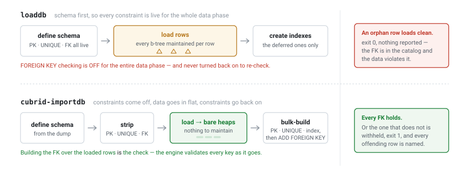

# CUBRID ImportDB

**A one-command reloader for CUBRID `unloaddb` dumps.** It reads the dump directory,
works out the load order from the schema's own dependency graph, loads the data into
constraint-free heaps, and rebuilds every index and foreign key afterwards. That makes
the reload faster than the schema-first script it replaces — and it makes the engine
actually check the foreign keys, which that script never does.

```
cubrid-importdb -u dba mydb /path/to/dump
```

That is the entire operator interface for a full-database reload: point it at the
directory `unloaddb` wrote, and it works out the rest.

---

## The problem

`unloaddb` hands you a directory. Reloading it is on you:

```sh
cubrid loaddb -C -u dba -s mydb_schema  mydb    # schema first, so every
cubrid loaddb -C -u dba -d mydb_objects mydb    # PK/UNIQUE/FK is live and
cubrid loaddb -C -u dba -i mydb_indexes mydb    # maintained per row
```

Three invocations for a small database, and the ordering is yours to get right.
That costs two things:

**Speed.** `unloaddb` writes primary keys, unique constraints **and foreign keys**
into `<prefix>_schema`, so schema-first means every constraint is live for the
entire data phase and maintained one row at a time. Only the plain secondary
indexes are deferred to `_indexes`.

**Correctness, and this is the one that matters.** `loaddb` turns foreign-key
checking *off* for the data phase and never turns it back on to re-check. Load a
dump containing an orphan row and it succeeds, reports nothing, and leaves you a
database where the FOREIGN KEY is present in the catalog **and violated by the
data** — a state the engine itself would refuse to create. You find out later,
from a wrong query answer.

CUBRID ImportDB replaces that with a single command that plans the load from the
dependency graph, loads into bare heaps and bulk-builds the constraints
afterwards, and refuses to define a foreign key the data does not satisfy —
telling you exactly which rows are at fault.



*Figure 1 — the same reload, two ways. Keeping the constraints live during the
data phase costs a b-tree maintenance per row and still does not check the
foreign keys; taking them off and building them afterwards makes the build
itself the check.*

## Features

| | |
|---|---|
| **One command for the whole dump** | Discovers the schema, object and index files, and the layout they were written in — default single-file or `--datafile-per-class`. No ordering for you to get right. |
| **Dependency-aware planning** | Reads the catalog after defining the schema and builds a graph from FK, inheritance, partitioning and serials, then loads in level order. FK definition is deferred for every edge, so mutually-referencing tables need no special handling — a cycle loads in one pass like anything else. |
| **Heap-only load** | Strips PK/UNIQUE/FK, loads into bare heaps, then bulk-builds the constraints on the populated tables. No per-row index maintenance during the data phase. |
| **Referential integrity is enforced, not assumed** | Every foreign key is defined against the loaded data. If the data violates one, the engine rejects it, and importdb enumerates *every* offending row (the engine names only the first) and withholds that FK rather than defining a broken one. |
| **A repair record you can act on** | `importdb.exceptions` lists each orphan by its primary key — or by position, for a child table that has none — and carries the exact DDL to add the withheld FK once the data is fixed. |
| **A live display** | On a terminal, a progress block shows the current phase, its position in the pipeline, and — during the data phase — how far each loader has read into its object file. Off automatically when stdout is not a terminal. |
| **Inter-table parallelism** | `--degree=N` runs N loaders concurrently, one per object file. It needs a `--datafile-per-class` dump to have anything to spread over. |
| **Resume** | A killed import re-run with the same command continues from its manifest instead of starting over. |
| **Honest about HA** | Refuses an `ha_mode=on` target by default, because the bare-heap load does not replicate to the standby. `--allow-ha` overrides and says so twice — once before the load and once in the verdict. |
| **`--dry-run`** | Prints the plan and the terminal task order; changes nothing. |

## How it works

**Discover → Define → Graph → Plan → Strip → Load → Rebuild → FK define → Stats →
Triggers.** The shape that matters is the middle: the schema is defined, its
constraint set is snapshotted and then *stripped*, the data goes into bare heaps,
and the constraints are bulk-built afterwards. Triggers are defined strictly last,
so nothing fires during the load.

Foreign keys are defined against the loaded data, which is where the engine
validates them — `ADD CONSTRAINT ... FOREIGN KEY` builds the FK's b-tree over the
existing rows and checks each key against the parent as it goes. importdb does not
duplicate that work; it only takes over where the engine stops.

Each phase announces what it did. A complete run, verbatim:

```
importdb: rostered default dump (prefix 'shop') from /tmp/rmcap/dump
    schema:   shop_schema (single)
    objects:  single (shop_objects)
    indexes:  shop_indexes
    triggers: (none)
importdb: defined 'shoptgt'; the target database is now fully defined and empty.
importdb: dependency graph for 'shoptgt' -- 5 node(s), 3 FK edge(s), 0 inheritance edge(s), 1 serial(s)
  - audit_log: pk=pk_audit_log uk=[] fk=[]   [serials=[audit_log_ai_entry_id]]
  - customer: pk=pk_customer uk=[uk_customer_email] fk=[fk_customer_region]
  - orders: pk=pk_orders uk=[] fk=[fk_orders_customer, fk_orders_product]
  - product: pk=pk_product uk=[uk_product_sku] fk=[]
  - region: pk=pk_region uk=[uk_region_code] fk=[]
  FK edges (child -> parent):
      customer -> region   (fk_customer_region)
      orders -> customer   (fk_orders_customer)
      orders -> product   (fk_orders_product)
  cycles: none
  level sets (parallel-eligible; complete=true):
      L0: [audit_log, product, region]
      L1: [customer]
      L2: [orders]
importdb: schedule for 'shoptgt' -- data phase 3 level(s), 17 terminal task(s)
  data phase (parallel-eligible level sets):
      L0: [audit_log, product, region]
      L1: [customer]
      L2: [orders]
  terminal tasks (in a valid execution order):
      #0  REBUILD_PK      audit_log (pk_audit_log)
      #1  REBUILD_PK      customer (pk_customer)
      #2  REBUILD_PK      orders (pk_orders)
      #3  REBUILD_PK      product (pk_product)
      #4  REBUILD_PK      region (pk_region)
      #5  REBUILD_UNIQUE  customer (uk_customer_email)
      #6  REBUILD_UNIQUE  product (uk_product_sku)
      #7  REBUILD_UNIQUE  region (uk_region_code)
      #8  BUILD_INDEX     <deferred indexes: shop_indexes>
      #9  FK_DEFINE       customer -> region (fk_customer_region)   [after #4, #7]
      #10 FK_DEFINE       orders -> customer (fk_orders_customer)   [after #1, #5]
      #11 FK_DEFINE       orders -> product (fk_orders_product)   [after #3, #6]
      #12 STATS           audit_log   [after #0, #8]
      #13 STATS           customer   [after #1, #5, #8]
      #14 STATS           orders   [after #2, #8]
      #15 STATS           product   [after #3, #6, #8]
      #16 STATS           region   [after #4, #7, #8]
importdb: stripped 11 constraint(s) from 'shoptgt'; the target now holds bare heaps ready for the data phase.
importdb: loaded 3008 row(s) from 1 object file(s) into 'shoptgt'; the target now holds data in bare heaps (constraints are rebuilt in a later phase).
importdb: rebuilt 8 constraint(s) and built 2 index(es) on 'shoptgt'; PK/UNIQUE and plain indexes are restored (FK definition is a later phase).
importdb: every FOREIGN KEY on 'shoptgt' was accepted by the engine -- 3 edge(s) clean, 0 skipped (parent key withheld). The engine validates the rows while it builds each FK.
importdb: defined 3 FK(s) on 'shoptgt'; the catalog now matches the dump snapshot (full round-trip complete).
importdb: updated statistics on 5 class(es) in 'shoptgt'.
```

### Knowing it worked

The run ends with a consolidated report — the per-class verdict, the row counts,
and anything left for you to repair. It is the answer to "did that actually
work?", and it is the same record `importdb.manifest` carries:

```
importdb: ===== import report: 'shoptgt' -- COMPLETE =====
  planned data order (3 level(s)):
      L0: [audit_log, product, region]
      L1: [customer]
      L2: [orders]
  classes (5 imported, 0 skipped):
      done     audit_log
      done     customer
      done     orders
      done     product
      done     region
  loaded: 3008 row(s) from 1 object file(s)
      shop_objects: 3008 row(s)
importdb: 'shoptgt' import COMPLETE -- 5 class(es) done, 0 skipped, 0 pending, 0 FK(s) withheld; 3008 row(s) loaded. Repair records + re-add DDL in /tmp/rmcap/dump/importdb.manifest.
```

Because everything the dump defines is replayed from the dump's own DDL, that
includes the parts a reload is easy to lose: **users and grants come back too**
(`unloaddb` writes an `add_user` call and the `GRANT` statements into
`<prefix>_schema`). Note that `unloaddb` does *not* carry passwords — a
re-created user has an empty one.

### The live display

On a terminal, the phase lines above scroll past under a block that is redrawn in
place. It answers what the printed lines cannot: which phase is running, how many
are left, and how far into it you are.

```
 importdb  tuitgt                                           load  [6/10]  00:00
  ███████████░░░░░░░░░░░░░░░░░░░░░░░░░░░░░░░░░░░░░░  23%  0/4 done · 2 loading
    tuisrc_dba.customer         ██████████████████████████████░░░░░  85%  2 MB
    tuisrc_dba.orders           ██████░░░░░░░░░░░░░░░░░░░░░░░░░░░░  17%  18 MB
```

*(A 400,050-row import at `--degree=2`, caught a fraction of a second in — the
elapsed clock is `MM:SS`.)*

The per-file bars are real, not estimated. The loaders are separate
`cub_admin loaddb -C` processes that report nothing until they exit, so importdb
reads each one's file offset out of `/proc/<pid>/fdinfo` — that is the only honest
progress signal a child of that shape has. It tracks the *read* of the object
file, which leads the commit of its rows, so a file sits at 100% for as long as
its last transaction takes.

The display is **off whenever stdout is not a terminal**, so a pipe, a file, a
`cron` job or a CI log gets exactly the plain output it always got. `--progress`
forces the question either way; `NO_COLOR` is honoured.

## Referential integrity

This is the difference worth showing. Take a dump with two orphan `orders` rows
whose `customer_id` does not exist.

**The hand-scripted `loaddb` path** accepts it, exit 0, nothing reported — the
FOREIGN KEY ends up in the catalog with data that violates it. Ask the engine to
create that same FK over that data and it refuses; `loaddb` left a state the
engine would not have allowed.

**CUBRID ImportDB** on the same dump loads the data, defines the clean FKs,
withholds the violated one, and exits 1:

```
importdb: stripped 11 constraint(s) from 'shopbad'; the target now holds bare heaps ready for the data phase.
importdb: loaded 3010 row(s) from 5 object file(s) into 'shopbad'; the target now holds data in bare heaps (constraints are rebuilt in a later phase).
importdb: rebuilt 8 constraint(s) and built 2 index(es) on 'shopbad'; PK/UNIQUE and plain indexes are restored (FK definition is a later phase).
importdb: the engine rejected the FOREIGN KEY and found 2 orphan row(s) on 'orders' -> 'customer' [fk_orders_customer]; that FK is withheld and its offenders enumerated.
importdb: 'shopbad' has referential violations -- 1 FOREIGN KEY(s) rejected by the engine, 2 orphan row(s) total; offenders written to /tmp/rmcap/perclass/importdb.exceptions. See the manifest [validate] section; importdb exits non-zero.
importdb: defined 1 FK(s), withheld 2 on 'shopbad' (the engine rejected the data, or the parent key was un-rebuilt); re-add DDL recorded in the manifest [fkdefine] section and /tmp/rmcap/perclass/importdb.exceptions. importdb exits non-zero.
importdb: updated statistics on 5 class(es) in 'shopbad'.
```

and writes the offenders to `importdb.exceptions` in the dump directory:

```
# CUBRID importdb FK re-validation exceptions (format v1)
# Written and owned by importdb; do not edit by hand.
# Each 'orphan' line is a child row whose foreign-key value has no matching parent primary key.
# An operator repairs the data from this file; the FK on these edges is left undefined.
generator: importdb
created: 2026-08-28T02:20:49Z
database: shopbad
policy: fail-fast
violated_edges: 1
total_orphans: 2

[edge] orders -> customer (fk_orders_customer)
child_key_columns: order_id
fk_columns: customer_id
orphans: 2
orphan: child[order_id=900001] fk[customer_id=777]
orphan: child[order_id=900002] fk[customer_id=888]

# CUBRID importdb FK define: the following FK(s) were NOT defined (withheld).
# An operator repairs the referenced data, then re-runs each 'readd' statement to add the FK.
[fk-withheld] orders -> customer (fk_orders_customer) :: ADD FOREIGN KEY rejected by the engine: 2 orphan row(s)
readd: ALTER CLASS [dba].[orders] ADD CONSTRAINT [fk_orders_customer] FOREIGN KEY([customer_id]) WITH DEDUPLICATE=0 REFERENCES [dba].[customer] ON DELETE RESTRICT ON UPDATE RESTRICT;
[fk-withheld] orders -> product (fk_orders_product) :: not attempted (fail-fast stopped at an earlier rejected edge)
readd: ALTER CLASS [dba].[orders] ADD CONSTRAINT [fk_orders_product] FOREIGN KEY([product_id]) WITH DEDUPLICATE=0 REFERENCES [dba].[product] ON DELETE RESTRICT ON UPDATE RESTRICT;
```

The engine names only the first offending value and stops; importdb enumerates all
of them. Fix the data, run the `readd:` statement, and the constraint set matches
the dump. `--continue` attempts every edge instead of stopping at the first.

`demo/run_demo.sh` runs both paths side by side — see [`demo/`](demo/README.md).

## Performance

Measured against a **parallelism-matched** `loaddb` baseline: the baseline runs its
per-class loads concurrently through a pool with the same bound, over the same
object files, so the comparison isolates the constraint lifecycle instead of
crediting importdb with the fan-out. Both arms run every phase in CS mode against
the same running server, and both update statistics.

`tests/run_tests.sh perf` **is** the measurement, and the only source for the
numbers below — there is no separate benchmark. It builds a 393,000-row fixture
over five object files, unloads it per class, and runs the two arms back to back
in pairs: one unmeasured warmup pair, then alternating arm order, reporting the
**median of the per-pair ratios**, because drift that moves both arms of a pair
barely moves their ratio.

| degree | loaddb | importdb | median ratio | |
|---|---|---|---|---|
| **1** | 5.70 s | 2.68 s | 0.481 &nbsp;(pairs 0.444 – 0.677) | **2.13× faster** |
| **4** | 5.08 s | 1.67 s | 0.362 &nbsp;(pairs 0.327 – 0.410) | **3.04× faster** |

Medians of five counted pairs each, 2026-08-28, on a 16-core Linux host at load
0.68 against CUBRID 11.5.0.2494 — the run itself is kept at
[`docs/perf-2026-08-28.log`](docs/perf-2026-08-28.log), so the table can be
audited rather than taken on trust. The advantage is the constraint lifecycle at
both degrees — the fan-out is held equal — and it grows with concurrency, from
2.1× to 3.0×. Why it grows is not something this case measures, so treat that
as an observation rather than an explanation.

This is a single-host trend on a shared machine, not a certified benchmark: the
same baseline work has been measured at 3.59 s and 6.07 s within one run, which
is exactly why the statistic is a ratio and not a stopwatch. The case prints
every pair, so measure your own hardware rather than trusting a number from
someone else's.

The only thing it asserts about speed is a tripwire, not a claim: the case fails
if the median ratio exceeds 1.5, which would mean importdb had become *slower*
than the thing it replaces. What it asserts on every pair, always, is correctness
parity — the two arms must agree with each other and with the source on the
catalog fingerprint and on every per-class row count. A disagreement about the
resulting database is a hard failure whatever the clock said.

Two honest caveats:

- **Small dumps do not benefit.** importdb's fixed setup — catalog snapshot,
  strip, rebuild, a per-file child process — is paid whatever the row count, so
  below some size it is *slower* than the thing it replaces. Where that crossover
  falls depends on your hardware and schema; measure before adopting it for small
  reloads.
- **`--degree` needs a `--datafile-per-class` dump.** The fan-out is over object
  files, so a default single-file dump runs serially no matter what you pass —
  silently, today.

## Requirements

- **CUBRID 11.5 or newer.** importdb reads the `_db_serial` system class to find
  AUTO_INCREMENT serials (the `db_serial` view omits them), and that read is
  rejected on 11.4 and earlier. This is not enforced by a version check: on an
  older engine the `_db_serial` probe in [`contract/`](contract/README.md) fails,
  and an actual import fails in the graph phase.
- Linux, a C++17 compiler, and CMake 3.16+ for importdb itself.
- To *configure* the CUBRID engine (which the build below does, for its generated
  headers) you also need Ninja or Make, a JDK, bison, flex, ncurses and
  `dtrace` — the set CI installs is `cmake ninja-build gcc g++ libncurses-dev
  bison flex openjdk-17-jdk systemtap-sdt-dev`. Neither of the last two is
  optional, and neither is obvious: the engine defaults `ENABLE_SYSTEMTAP` on and
  its CMake stops without `dtrace`, and its `find_package(JNI REQUIRED)` wants
  AWT, which a *headless* JDK does not ship.
- A CUBRID **source tree** and a configured **build tree** to compile against, plus
  an **installed** CUBRID to link and run against. See [Install](#install).

## Install

This is a source distribution: you build it against the CUBRID it will run with.
There is no binary release, and that is deliberate — see
[docs/out-of-tree.md](docs/out-of-tree.md).

The quickest path is the nightly drop, which publishes the source and the install
as a matched pair from the same build:

```sh
git clone https://github.com/cubrid-systems/cubrid-importdb
cd cubrid-importdb

# fetch a CUBRID source tree + install from ftp.cubrid.org (same build, no skew)
tools/fetch_engine.sh --nightly 11.5 engine

# the utility's translation units need the engine's generated and 3rdparty
# headers, which come from a CONFIGURED build tree -- not from a built engine
cmake -S engine/src -B engine/build -G Ninja -DCMAKE_BUILD_TYPE=RelWithDebInfo
cmake --build engine/build --target rapidjson re2 lz4 libexpat libjansson

export CUBRID="$PWD/engine/install"
cmake -S . -B build -DCUBRID_SOURCE_DIR="$PWD/engine/src" -DCUBRID_BUILD_DIR="$PWD/engine/build"
cmake --build build -j"$(nproc)"

build/cubrid-importdb            # prints the usage
```

Configuring the engine and building only its header producers takes about 20
seconds. The engine itself is never built.

Against a CUBRID you already have, point `CUBRID_SOURCE_DIR` and `CUBRID_BUILD_DIR`
at your own trees and `$CUBRID` at the install. `$CUBRID` must be set at configure
time: the build bakes `$CUBRID/lib` and `$CUBRID/cci/lib` into the binary's
`RUNPATH`, because `libcubridcs` depends on `libcascci` from a directory nothing
else puts on the loader path.

> The build also reads the engine library's libstdc++ ABI with `nm` and matches it.
> Published CUBRID binaries use the pre-C++11 `std::string` ABI; a modern compiler
> does not. You should never have to think about this, but if a link ever fails on
> `cubload::` symbols, `-DFORCE_OLD_CXX_ABI=ON` is the override.

## Usage

```
importdb: Import an unloaddb dump into a running database.
usage: cubrid-importdb [OPTION] database-name dump-dir

valid options:
    -u, --user=ID               import user; must belong to the DBA group
    -p, --password=PASS         password of the import user
    --degree=N                  inter-table parallel degree
    --continue                  attempt every FK edge instead of stopping at the first rejected one
    --skip-object-classes       skip and report object-valued classes instead of rejecting them
    --dry-run                   print the import plan and terminal tasks; change nothing
    --restart                   ignore an interrupted run's manifest and import from scratch
    --allow-ha                  import into an ha_mode=on target anyway; the standby will NOT
                                receive the rows and must be rebuilt from a backup
    --progress=WHEN             live progress display: auto (default; on when stdout is a
                                terminal), always, or never
    --exceptions-table=NAME     reserved for a future release
```

The target database must exist, be **running**, and be **empty** of user classes.
The dump directory must be **writable** — importdb writes `importdb.manifest`
(the resume point) and, on a violation, `importdb.exceptions` into it.

**Exit status is `0` or `1`, and nothing else.** `0` means the run completed with
nothing left over. `1` covers everything else, including cases that are not
failures of the load: a rejected argument, a connection that failed, an aborted
run — but also a run that loaded and committed and then left work behind, whether
that is a withheld FK, an un-rebuilt constraint, a failed statistics update or a
trigger that would not define. To tell those apart, read the final report line,
which names each category, and `importdb.manifest`, which records them.

```sh
# produce the dump in the first place (server down for -S; -C works with it up)
cubrid unloaddb -S -u dba mydb            # writes mydb_{schema,objects,indexes} here

# the common case
cubrid-importdb -u dba mydb /dumps/mydb

# see the plan without touching anything
cubrid-importdb -u dba --dry-run mydb /dumps/mydb

# parallel: the dump must be per-class for --degree to have anything to spread over
cubrid unloaddb -S -u dba --datafile-per-class mydb
cubrid-importdb -u dba --degree=4 fresh_target /dumps/mydb

# a dump you suspect: report every violated edge instead of stopping at the first
cubrid-importdb -u dba --continue mydb /dumps/mydb

# resume after a kill -- the same command, nothing new to type
cubrid-importdb -u dba mydb /dumps/mydb

# plain output on a terminal (scripts and pipes get it without asking)
cubrid-importdb -u dba --progress=never mydb /dumps/mydb
```

`unloaddb` writes into the current directory and `-S` needs the server stopped,
so the dump and the import are two separate steps against two separate databases:
you cannot reload a database on top of itself.

## What it does not do

- **It does not replace `loaddb`.** Single-file, single-table loads are what
  `loaddb` is for, and it is untouched.
- **It does not read foreign dumps.** CUBRID `unloaddb` output only.
- **It is not an online load.** The target must be empty of user classes; this is
  a reload, not an ingest.
- **It does not carry object-valued (OID) columns.** CS-mode loading handles
  value-typed data; classes with object columns are rejected, or skipped and
  reported with `--skip-object-classes`.
- **It does not restore user passwords.** Users and grants come back, because
  `unloaddb` writes them into the schema file — but `unloaddb` emits every user
  with an empty password, so re-created users must have theirs set again.
- **It does not replicate to an HA standby.** The bare-heap load produces no row
  replication, so an `ha_mode=on` target is refused unless you pass `--allow-ha`
  and rebuild the standby from a backup afterwards.

## Development

```sh
cmake --build build -j                       # build
tests/run_tests.sh                           # the functional suite
tests/run_tests.sh -k resume fkviolation     # one or more cases, keep the scratch dir
bash demo/run_demo.sh build/cubrid-importdb  # the demo, four scenarios
ctest --test-dir build --output-on-failure   # contract + smoke + functional
```

`ctest` includes the performance case, which builds a 393,000-row fixture and runs
paired imports at two degrees — budget half an hour for it, or run
`tests/run_tests.sh` with the case names you want instead.

| | |
|---|---|
| [`tests/`](tests/README.md) | 9 cases, 202 assertions: round-trip fidelity, dependency ordering, FK cycles, FK violations, `--dry-run`, `--degree`, resume after `SIGKILL`, refusals, and the performance comparison |
| [`demo/`](demo/README.md) | 4 scenarios, 34 assertions — the `loaddb` contrast, the plan, the FK violation, and what parallelism actually depends on |
| [`contract/`](contract/README.md) | What this repo depends on from CUBRID, enumerated and machine-checked: 41 static checks against an install, 16 runtime checks against a live database, plus a negative control that must fail |
| [`docs/out-of-tree.md`](docs/out-of-tree.md) | How the build works against an engine it does not live in, and the libstdc++ ABI question |

### Identity

[`assets/`](assets/) holds three SVGs: `banner.svg` (the header at the top),
`lifecycle.svg` (the figure in [The problem](#the-problem)), and `mark.svg` —
the mark on its own, for a favicon, an avatar, or anywhere the banner is too wide.


The mark is not the banner's tangram shrunk. Seven colours do not survive 16px,
so it reduces the square to the three right-isosceles pieces it actually
decomposes into — areas 4 + 4 + 8 — keeping the same 45° geometry, the same
CUBRID palette, and the same gesture: one piece not yet seated. All three files
are theme-aware, with light as the base palette and a `prefers-color-scheme: dark`
block overriding only what must change, so a renderer that ignores the media
query still gets a correct picture rather than an invalid one.

Two workflows run in this repo — [`contract.yml`](.github/workflows/contract.yml)
checks the CUBRID surface this code depends on, and
[`nightly.yml`](.github/workflows/nightly.yml) builds and imports against a
nightly engine. A third, `upstream-guard.yml.for-cubrid-repo`, is written to be
installed **in the engine repo**, where it compiles this repo on every upstream PR
that touches a path importdb depends on; the filename suffix means it does not run
here.

## Provenance

CUBRID ImportDB began as `cubrid importdb` inside the CUBRID engine tree, under
the CUBRID Systems Research roadmap project **N54**. It changes no engine code and
adds nothing to the server: it builds against the engine's source and configured
build tree, links exactly one engine library (`libcubridcs`), and drives the
existing `loaddb` loader for the data phase. The whole utility is orchestration
over primitives CUBRID already had — [`contract/`](contract/README.md) enumerates
every one of them and checks they are still there.

Apache License 2.0, following CUBRID. See [LICENSE](LICENSE).
